如何申請使用集中化網站
======================

目前僅開放臺北市高國中小申請，但目前還有一些細節要調整與修正，約莫 2020/11 月中會將學校必要的幾個細節都修正完成。

若貴校想要參與移轉，可填寫申請表單： https://forms.gle/kG1uoH7mK9TEdYHa6

有任何申請上的問題，可聯繫本專案的開發與維運人員。

在申請表單前，請協助確認貴校的 webmaster Email 位址是可以收到信的。設定好之後，可以使用您私人或是非學校的 Email 帳號
寄給 webmaster，若學校的資訊人員可以收到測試信，那就代表設定正確無誤。以下截圖說明設定的步驟，供各校參考。

設定 webmaster 郵件群組 - 以 Google G Suite 為例
-----------------------------------------------
進入管理控制台。

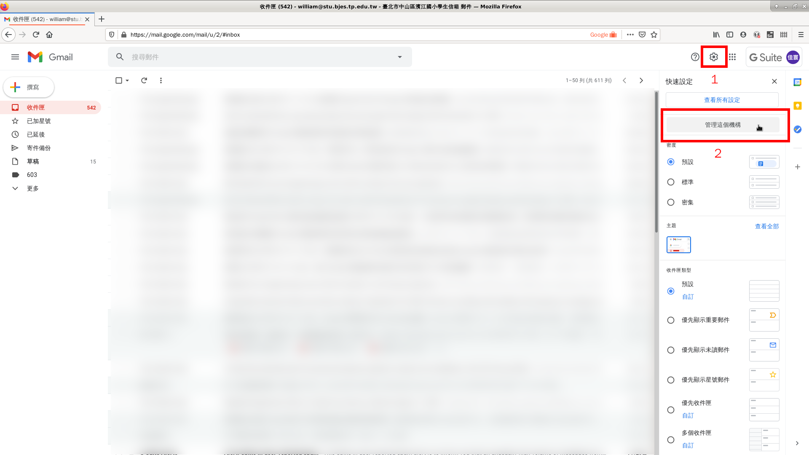

進入群組設定。

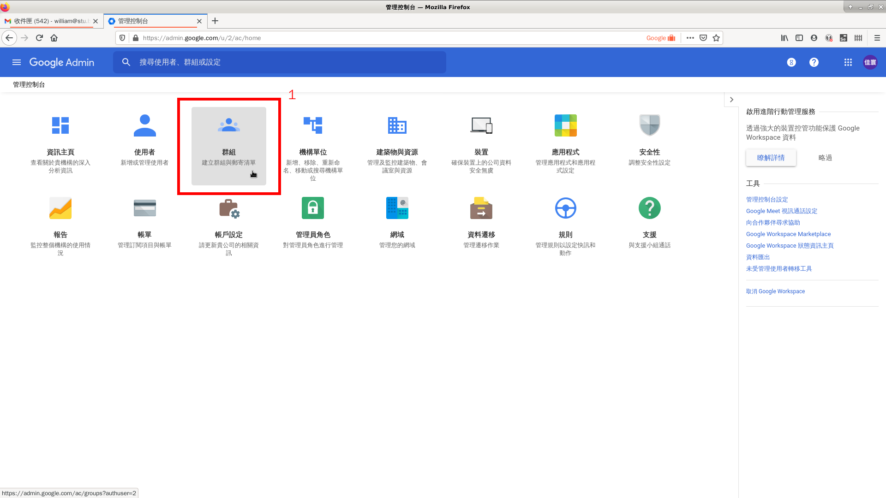

建立群組。

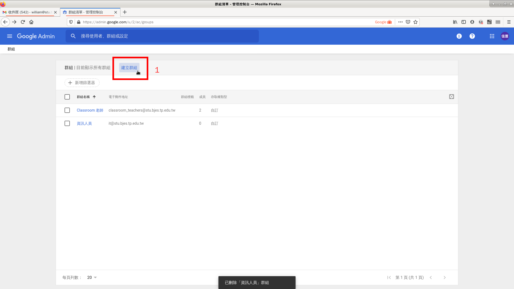

下面截圖的範例是將資訊人員的群組設定為 it，然後於後面的步驟將 webmaster 等群組設為 it 群組的別名，可依各校需求調整。
若沒特別想法就照這邊的範例設定吧。

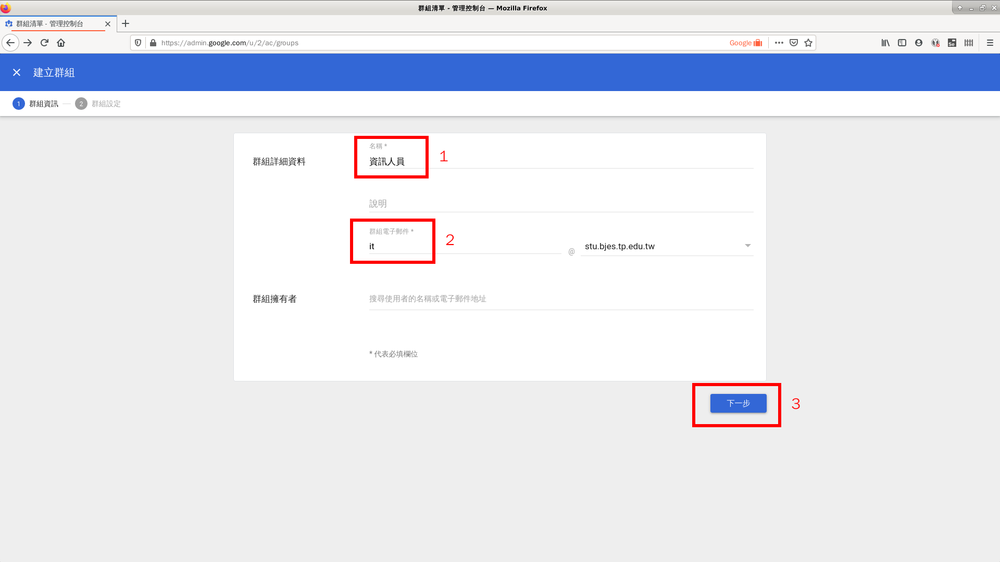

在 G Suite 中，預設建立的群組權限只能收組織內部成員的信件。因此我們要額外開放權限，讓外部也可寄信至此 Email 群組中。
以下是開放權限的範例截圖。

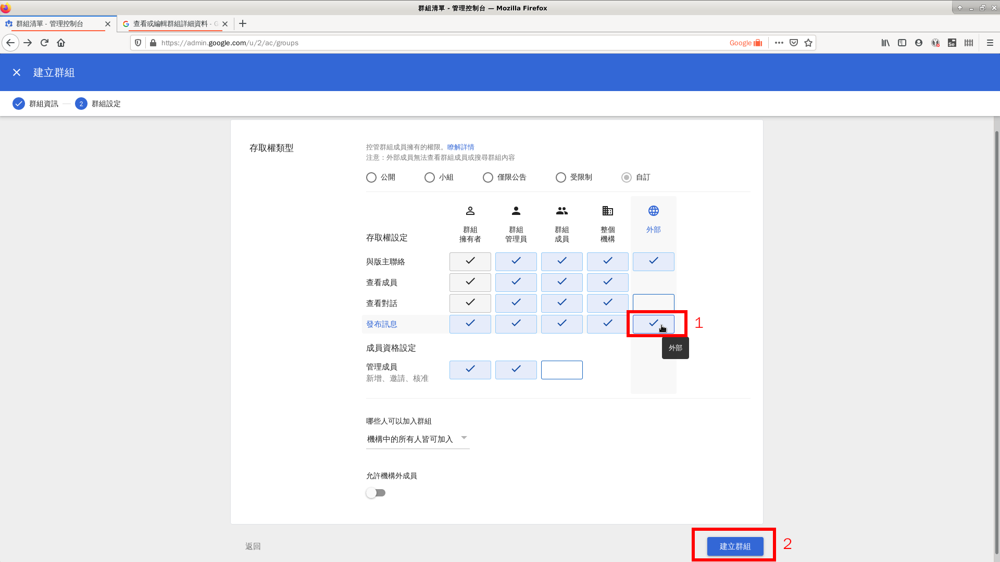

點進去剛建立好的群組做後續的設定。

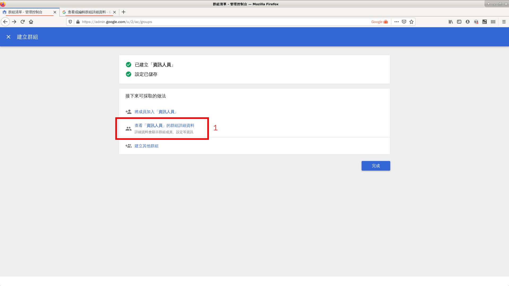

設定額外的別名。

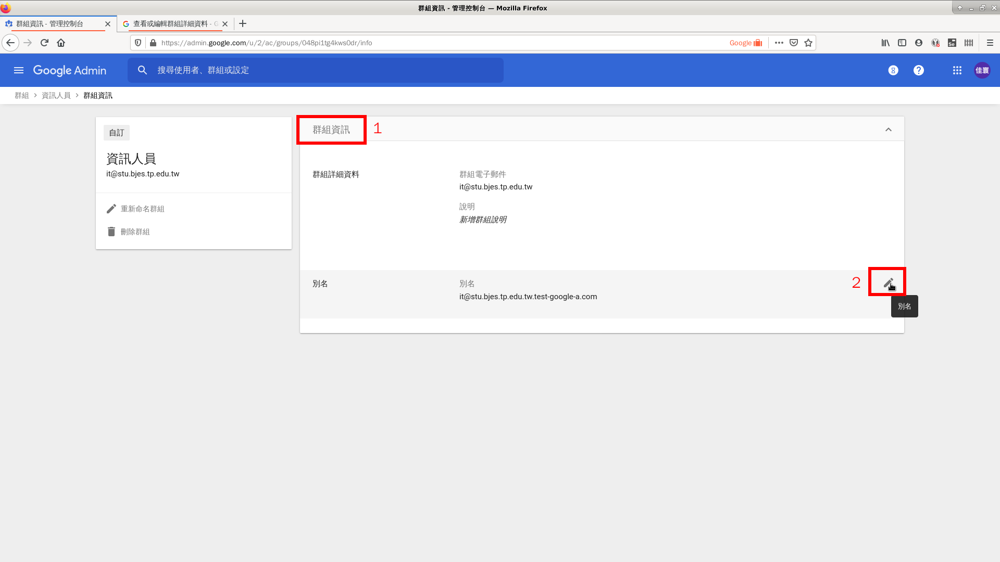

新增 webmaster 為此群組的別名。

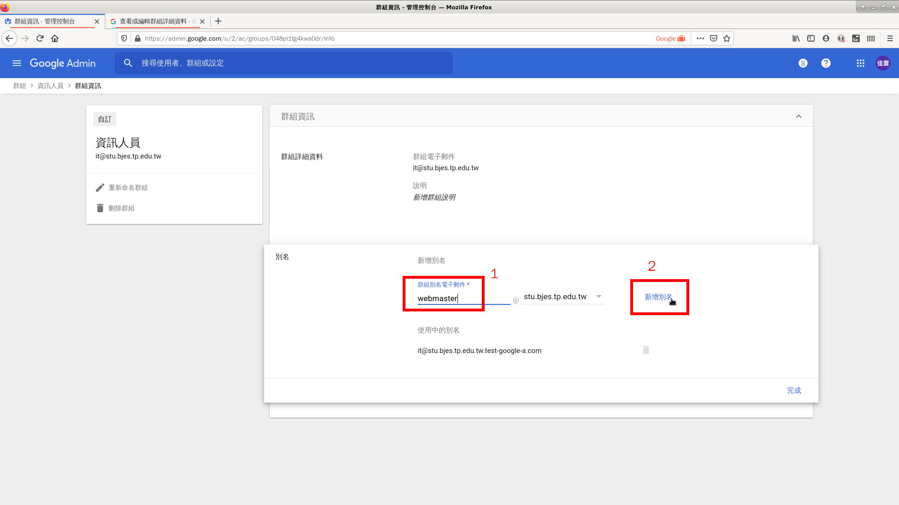

完成別名設定。

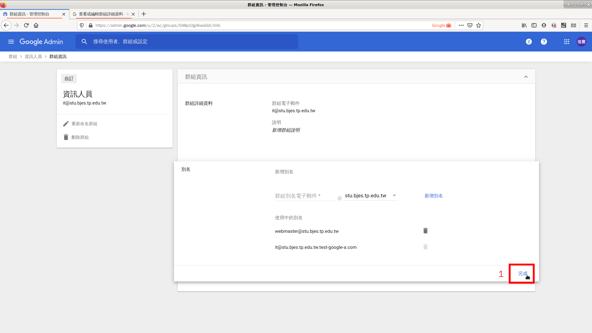

回到上一頁。

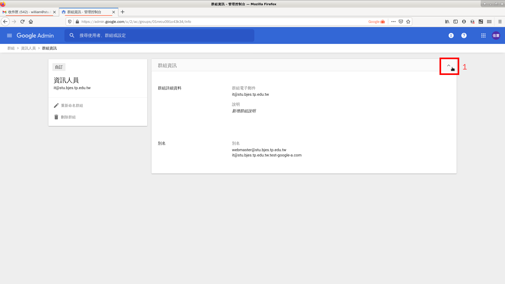

新增成員（或是其他群組也可）至此群組中。

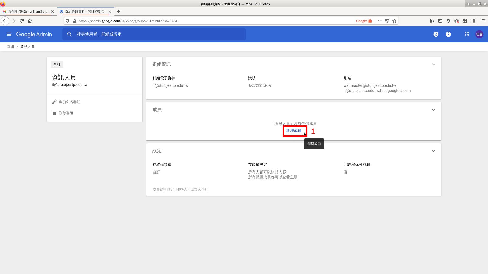

滑鼠移至下圖黃色圓形圖案，待圖案更換後，點選新增成員。

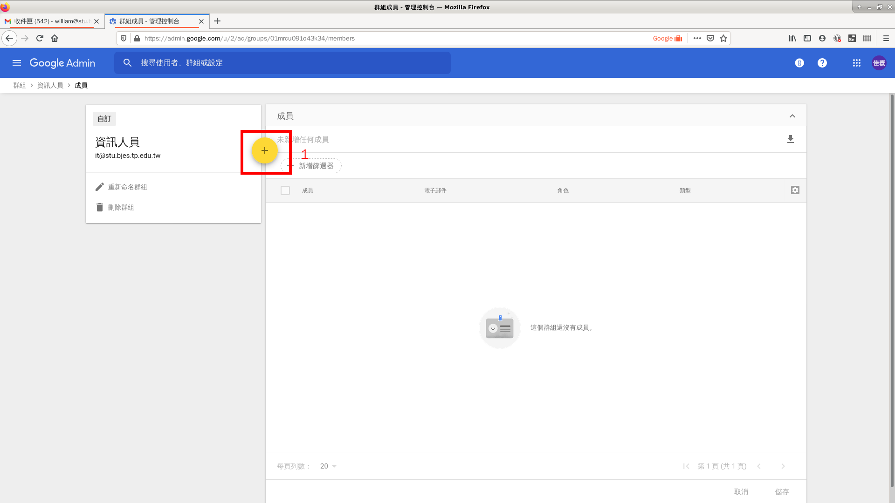

依序加入學校所有資訊人員的 Email 位址。這邊也可以加入其他的群組，讓群組成為樹狀的關係。

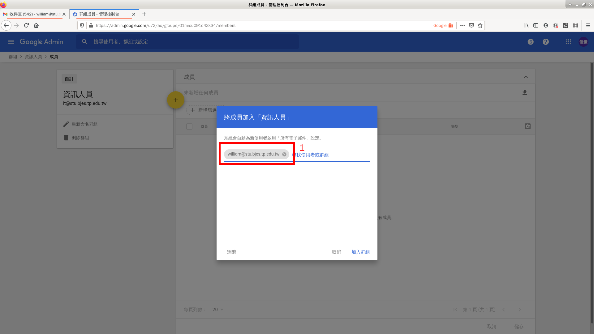

完成設定。

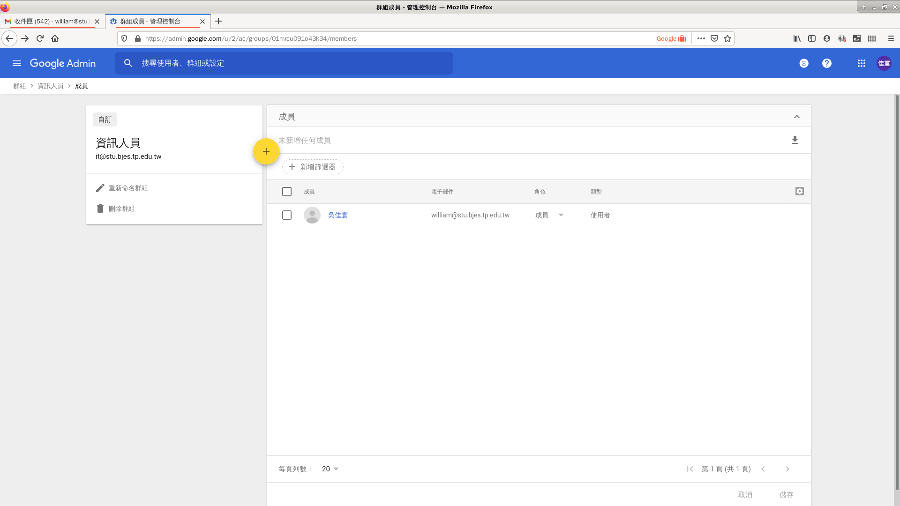

