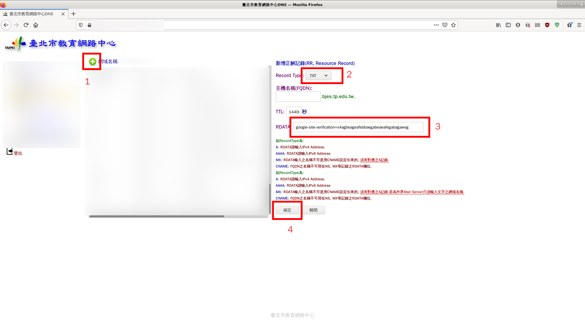
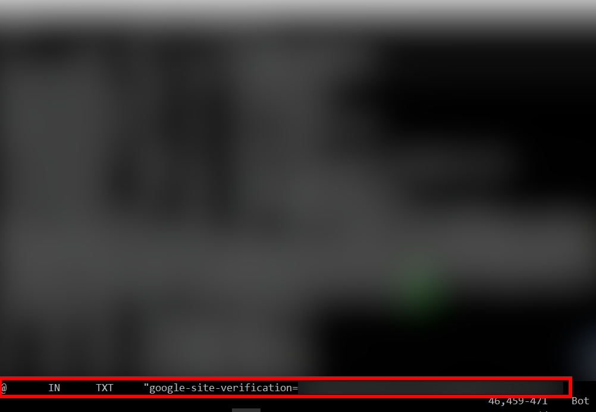

如何申請使用集中化網站
======================

目前僅開放臺北市高國中小申請，但目前還有一些細節要調整與修正

若貴校想要參與移轉，請先完成以下的前置作業。設定上若有任何問題，可聯繫 william@bjes.tp.edu.tw 。

前置作業
++++++++

在轉移前，請協助確認以下幾點前置作業：

1. 貴校的根網域 (root domain) 是可以收信的。
2. 寄給貴校的 webmaster@xxxx.tp.edu.tw (其中的 xxxx 請更換成貴校的網域代號) 可正確的將信件轉寄給學校資訊組與系管師。
3. 完成貴校的 tpyass.xxxx.tp.edu.tw 的 dns A / AAAA record 指派

所謂的根網域，就是指貴校的網域，前面不含任何的前綴。以濱江國小舉例：濱江國小的網域代號是 bjes ，那根網域就是 
bjes.tp.edu.tw 。所以上面兩點要求，就是希望寄信給 webmaster@xxxx.tp.edu.tw (其中的 xxxx 請更換成貴校的網域代號)
都是可以收到信的。集中化網站未來各種通知或是重設管理者密碼，都會使用 webmaster 這個郵件群組，請要使用集中化網站的學校
幫忙，讓這個郵件群組可以變成各校資訊管理人員統一對外的郵件群組。

若設定好上述兩點後，可以使用您私人或是非學校的 Email 帳號
寄給 webmaster@xxxx.tp.edu.tw 測試設定是否正確。若學校的資訊人員可以收到測試信，那就代表正確無誤。
以下截圖說明設定根網域與 webmaster 郵件群組的步驟，供各校參考。

設定根網域
----------
如果貴校的 dns 使用集中化的 dns 管理，那就按照下圖，新增 MX 設定。新增的設定會需要等待一段時間才會生效，
所以建議等待 15 分鐘後再繼續往下設定。

或如果貴校的 dns 是使用 bind 架設，那請按照下圖，於 zone file 裡面新增根網域的 MX 設定。設定完記得 serial number 要遞增，
並重新啟動 bind 服務。

設定完 dns 的 MX 紀錄，並等到設定生效後，到 Google 管理控制台 -> 網域，我們要到這邊新增根網域。

點選管理網域。

下面的畫面是以立農國小作為示範。從下圖可以看到立農國小將 cc.lnes.tp.edu.tw 做為主網域，因此我們要新增網域別名，
並加入根網域。點選新增網域別名。

輸入根網域。以立農國小為例，該校的根網域即為 lnes.tp.edu.tw 。

接下來要讓 Google 驗證貴校的根網域了。請按照下圖點選，並複製步驟 3 的 txt 紀錄。

如果貴校 dns 是使用集中化 dns 管理，則按照下圖新增一筆 txt 紀錄，並將上一步所複製的文字貼到步驟 3 的位置。
此步驟一樣需要等待一段時間才會生效，建議等待 15 分鐘後再繼續往下操作。

或若貴校 dns 是使用 bind 架設，則按照下圖於 zone file 建立 txt 的紀錄。設定完記得 serial number 要遞增，服務要重啟。

回到 Google 管理控制台，按下驗證。

如果驗證沒問題，則會出現以下畫面。

最後就是新增 postmaster / webmaster 群組，最重要的是下圖紅框處，要將 webmaster@xxxx.tp.edu.tw 設定為別名，最後再用
外部的郵件寄給 webmaster 測試是否能正常收信。

設定 webmaster 郵件群組 - 以 Google G Suite 為例
------------------------------------------------
進入管理控制台。

.. image:: images/設定webmaster群組/01.png

進入群組設定。

建立群組。

下面截圖的範例是將資訊人員的群組設定為 it，然後於後面的步驟將 webmaster 等群組設為 it 群組的別名，可依各校需求調整。
若沒特別想法就照這邊的範例設定吧。

在 G Suite 中，預設建立的群組權限只能收組織內部成員的信件。因此我們要額外開放權限，讓外部也可寄信至此 Email 群組中。
以下是開放權限的範例截圖。

.. image:: images/設定webmaster群組/05.png

點進去剛建立好的群組做後續的設定。

.. image:: images/設定webmaster群組/06.png

設定額外的別名。

.. image:: images/設定webmaster群組/07.png

新增 webmaster 為此群組的別名。

.. image:: images/設定webmaster群組/08.png

完成別名設定。

.. image:: images/設定webmaster群組/09.png

回到上一頁。

新增成員（或是其他群組也可）至此群組中。

.. image:: images/設定webmaster群組/11.png

滑鼠移至下圖黃色圓形圖案，待圖案更換後，點選新增成員。

依序加入學校所有資訊人員的 Email 位址。這邊也可以加入其他的群組，讓群組成為樹狀的關係。

完成設定。

於貴校的 dns 紀錄上新增 A 與 AAAA 紀錄
--------------------------------------

由於各校的學校網站還在運行（網址通常會是 www.xxxx.tp.edu.tw），所以在這個過渡期，我們需要貴校用另一組 dns 紀錄來指向到
新的集中化網站 ip 。因此請在 dns 上設定兩筆紀錄：

請建立一筆 dns A 紀錄，將 tpyass.xxxx.tp.edu.tw 指向到 163.21.135.145 ，如下圖：

.. image:: images/建立dns紀錄/01.png

請建立一筆 dns AAAA 紀錄，將 tpyass.xxxx.tp.edu.tw 指向到 2001:288:1200::135:145 ，如下圖：

這樣就完成了 dns 紀錄設定。

填寫申請表單
++++++++++++

前置作業完成後，請到此處填寫表單： https://forms.gle/kG1uoH7mK9TEdYHa6

填完之後，本專案的開發人員就會透過貴校的 webmaster 郵件群組跟貴校資訊人員聯繫，以進行後續的移轉作業。
